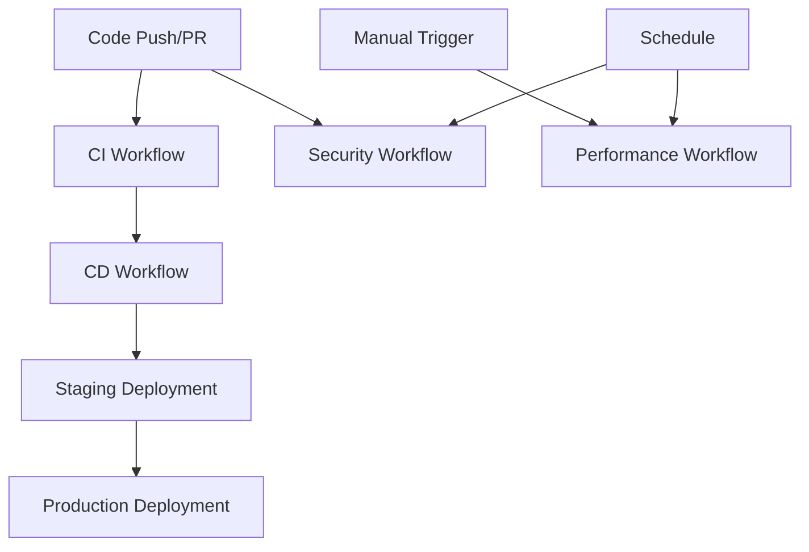

# GitHub Actions 工作流说明

本项目使用独立的 GitHub Actions 工作流来实现 CI/CD 流水线，提供更好的可维护性和灵活性。

## 工作流文件

### 1. 持续集成 (CI) - `ci.yml`
**目的**: 代码质量和测试验证

**触发条件**:
- Push 到 `main` 或 `develop` 分支
- Pull Request 到 `main` 分支

**包含的任务**:
- ✅ Python 服务测试 (ingestion-service, inference-backend)
- ✅ 前端测试 (inference-frontend)
- ✅ 代码质量检查 (SonarCloud)
- ✅ 集成测试
- ✅ Docker 构建测试

### 2. 持续部署 (CD) - `cd.yml`
**目的**: 自动化部署和发布

**触发条件**:
- CI 工作流成功完成
- 手动触发 (workflow_dispatch)

**包含的任务**:
- 🚀 Docker 镜像构建和推送
- 🌍 部署到 Staging 环境
- 🏭 部署到 Production 环境 (需要审批)
- 🔄 自动回滚功能
- 📢 部署通知

### 3. 安全扫描 - `security.yml`
**目的**: 安全漏洞检测

**触发条件**:
- Push 到 `main` 或 `develop` 分支
- Pull Request 到 `main` 分支
- 定时扫描 (每日 2:00 AM UTC)

**包含的任务**:
- 🔍 Trivy 漏洞扫描
- 🛡️ Semgrep 代码安全分析
- 📋 OWASP 依赖检查

### 4. 性能测试 - `performance.yml`
**目的**: 性能回归检测

**触发条件**:
- 手动触发
- 定时执行 (每周)

**包含的任务**:
- ⚡ k6 负载测试
- 📊 性能指标收集
- 📈 性能报告生成

## 工作流依赖关系



## 使用指南

### 开发工作流

1. **功能开发**:
   ```bash
   git checkout -b feature/your-feature
   # 开发代码
   git push origin feature/your-feature
   ```

2. **创建 Pull Request**:
   - CI 工作流自动运行
   - 检查所有测试和质量检查

3. **合并到 main**:
   - CI 工作流完整运行
   - CD 工作流自动部署到 staging

4. **生产部署**:
   - 手动触发 CD 工作流
   - 选择 production 环境
   - 需要环境保护规则审批

### 手动部署

如需手动部署，可以：

1. 访问 GitHub Actions 页面
2. 选择 "Continuous Deployment" 工作流
3. 点击 "Run workflow"
4. 选择环境 (staging/production)
5. 可选择强制部署 (跳过 CI 检查)

### 紧急回滚

如果生产部署出现问题：

1. CD 工作流会自动尝试回滚
2. 也可以手动触发回滚流程
3. 备份文件会自动创建和保存

## 环境配置

### 必需的 GitHub Secrets

```
# Docker Hub
DOCKER_USERNAME=your_dockerhub_username
DOCKER_PASSWORD=your_dockerhub_password

# SonarCloud
SONAR_TOKEN=your_sonarcloud_token

# Kubernetes (if using)
KUBECONFIG_STAGING=base64_encoded_kubeconfig
KUBECONFIG_PRODUCTION=base64_encoded_kubeconfig

# Notifications
SLACK_WEBHOOK_URL=your_slack_webhook_url
```

### 环境保护规则

建议在 GitHub 仓库设置中配置：

- **staging**: 无需审批，自动部署
- **production**: 需要团队成员审批，部署延迟 5 分钟

## 监控和通知

### 工作流状态监控

- 所有工作流状态会发送到 Slack
- 失败的工作流会创建 GitHub Issue
- 性能报告会自动生成和归档

### 性能基准

- 响应时间: 95% < 200ms
- 错误率: < 0.1%
- 吞吐量: > 1000 req/s

## 故障排除

### 常见问题

1. **CI 失败**:
   - 检查测试日志
   - 验证代码质量问题
   - 确认依赖项版本

2. **CD 部署失败**:
   - 检查 Docker Hub 凭据
   - 验证 Kubernetes 连接
   - 查看部署日志

3. **安全扫描问题**:
   - 更新有漏洞的依赖项
   - 修复代码安全问题
   - 更新基础镜像

### 获取帮助

- 查看工作流日志
- 检查 GitHub Actions 文档
- 联系 DevOps 团队

---

**注意**: 此工作流配置提供了生产级别的 CI/CD 流水线，包含完整的测试、安全检查、部署和监控功能。
