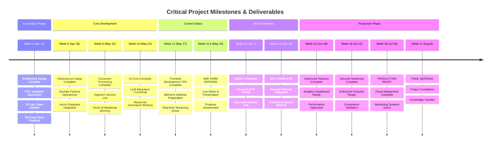

# Enterprise RAG System - Project Roadmap for Mid-Term Defense

## 🎯 Project Overview

**Transformation Journey**: From Jupyter Notebook POC to Enterprise RAG Microservices System

- **Project Duration**: March 16, 2025 - August 8, 2025 (21 weeks total)
- **Current Progress**: Week 11 - Sprint 4 (Frontend Development) in progress
- **Current Status**: 🔄 **70% Complete - MVP Development Phase**
- **Mid-Term Defense**: May 29, 2025 (Week 11 target completion)
- **Project Type**: Internship project - notebook to microservices transformation
- **Architecture**: Research Notebook → Production Microservices with 32 Use Cases

---

## 📋 Current Project Status (As of Week 11 - May 27, 2025)

### **Project Progress Overview**
```
Phase 1: Architecture & Design (Weeks 1-4)    ✅ COMPLETED (100%)
Phase 2: MVP Development (Weeks 5-14)         🔄 IN PROGRESS (70%)
Phase 3: Production Enhancement (Weeks 15-21) 📋 PLANNED (0%)
```

### **Immediate Focus: Mid-Term Defense Preparation** 🎯
- **Target Date**: May 29, 2025 (This Thursday)
- **Current Sprint**: Sprint 4 (Frontend Development - Week 11-12)
- **Defense Goal**: Demonstrate working MVP with 32 use cases mapped to actual implementation

### **Current Working Components** ✅
- ✅ **Ingestion Service**: FastAPI backend with document processing
- ✅ **Inference Service**: LlamaIndex + OpenAI integration with streaming
- ✅ **Milvus Database**: Vector storage and similarity search
- ✅ **Basic Frontend**: Next.js chat interface (partial)
- ✅ **NeMo Guardrails**: Content safety and moderation
- ✅ **Docker Setup**: Containerized services for development

### **Currently In Development** 🔄
- 🔄 **Frontend Chat UI**: Real-time streaming responses (Sprint 4)
- 🔄 **User Authentication**: JWT-based session management
- 🔄 **Mobile Responsiveness**: Responsive design implementation
- 🔄 **Document Lifecycle**: Advanced document management features
- 🔄 **System Monitoring**: Basic monitoring and alerting setup

### **Planned for Defense** 📋
- 📋 **Live Demonstration**: Working end-to-end RAG system
- 📋 **Use Case Coverage**: Show implementation of key use cases from diagram
- 📋 **Performance Metrics**: Response time and accuracy demonstrations
- 📋 **Architecture Overview**: Microservices decomposition explanation

---

## 🎯 Enhanced Key Milestones & Critical Success Metrics

### **🏆 Major Project Milestones**



### **📊 Success Metrics Dashboard**

| **Milestone** | **Completion Date** | **Success Criteria** | **Current Status** |
|---|---|---|---|
| **🎓 Mid-term Defense** | May 29, 2025 | Working demo + 75% completion | 🔄 **Preparing** |
| **🚀 MVP Complete** | June 14, 2025 | All core features + security | 📋 **Planned** |
| **🏢 Production Ready** | July 26, 2025 | Enterprise features + deployment | 📋 **Planned** |
| **🏆 Final Defense** | August 8, 2025 | Complete system + documentation | 📋 **Planned** |

### **🎯 Current Sprint 4 Key Deliverables (Week 11-12)**

| **Feature** | **Completion %** | **Target Date** | **Status** |
|---|---|---|---|
| **React Chat Interface** | 75% | May 31, 2025 | 🔄 **Active Development** |
| **Real-time Streaming** | 80% | June 3, 2025 | 🔄 **Testing Phase** |
| **User Authentication** | 60% | June 7, 2025 | 🔄 **In Progress** |
| **Mobile Responsiveness** | 40% | June 7, 2025 | 🔄 **In Progress** |
| **Defense Preparation** | 90% | May 29, 2025 | 🔄 **Final Review** |

---

## 🎯 Use Case Mapping to Current Implementation

Based on the 32 use cases identified in our system diagram, here's the current implementation status:

### **Knowledge Query & Chat Package** (7 Use Cases)
- ✅ **UC1 Ask Questions**: Implemented in inference service
- ✅ **UC2 Receive AI Answers**: Working with OpenAI integration
- ✅ **UC3 Stream Real-time Responses**: Functional streaming API
- 🔄 **UC4 Maintain Chat Sessions**: In development (Sprint 4)
- 📋 **UC5 Export Chat History**: Planned for Sprint 5
- 📋 **UC6 Search Previous Conversations**: Planned for later phases
- 🔄 **UC7 Rate Answer Quality**: Basic implementation in progress

### **Document Management Package** (7 Use Cases)
- ✅ **UC8 Upload Documents**: Core ingestion service complete
- ✅ **UC9 Organize Document Collections**: Basic categorization working
- 🔄 **UC10 Update Document Content**: Lifecycle management in progress
- ✅ **UC11 Delete Outdated Documents**: Soft delete implemented
- ✅ **UC12 View Document Status**: Status tracking functional
- 📋 **UC13 Manage Document Access**: Planned for security sprint
- ✅ **UC14 Bulk Import Documents**: Batch processing working

### **Content & Quality Control Package** (6 Use Cases)
- ✅ **UC21 Review Content Quality**: NeMo Guardrails integrated
- ✅ **UC22 Moderate AI Responses**: Output filtering active
- ✅ **UC23 Configure Content Filters**: Basic configuration available
- 📋 **UC24 Approve Document Publications**: Workflow planned
- ✅ **UC25 Set Content Guidelines**: Guardrails policies defined
- ✅ **UC26 Monitor Content Compliance**: Basic monitoring active

### **User & Access Management Package** (6 Use Cases)
- 🔄 **UC15 User Authentication**: JWT implementation in progress
- 📋 **UC16 Manage User Permissions**: RBAC planned for Sprint 5
- 📋 **UC17 Control Document Access**: Authorization framework planned
- 📋 **UC18 Monitor User Activities**: Audit logging planned
- 📋 **UC19 Configure System Settings**: Admin interface planned
- 📋 **UC20 Manage User Groups**: Group management planned

### **Analytics & Reporting Package** (6 Use Cases)
- 📋 **UC27-32**: All analytics use cases planned for Phase 3
- Basic metrics collection infrastructure in place
- Comprehensive analytics dashboard planned for final phase

---

## 🚀 Sprint Progress & Timeline

### **✅ Phase 1: Architecture & Design (Weeks 1-4) - COMPLETED**
**Sprint Goal**: Transform notebook POC into enterprise architecture plan

**Completed Deliverables**:
- ✅ Business requirements analysis and user story mapping
- ✅ Microservices architecture design with 32 use cases
- ✅ Technology stack selection (FastAPI + LlamaIndex + Milvus + NeMo + Next.js)
- ✅ Risk assessment and mitigation strategies
- ✅ Development environment setup and CI/CD pipeline foundation
- ✅ Proof of concept validation from `sentence_window_node_parser_rag.ipynb`

**Key Architectural Decisions**:
- Microservices decomposition: Ingestion + Inference + Frontend
- Vector database: Milvus for GPU-accelerated search
- AI safety: NeMo Guardrails for content moderation
- Frontend: Next.js for modern chat interface

---

### **🔄 Phase 2: MVP Development (Weeks 5-14) - 70% COMPLETE**

#### **✅ Sprint 1: Foundation Infrastructure (Weeks 5-6) - COMPLETED**
**Sprint Goal**: Establish core microservices foundation

**Completed Deliverables**:
- ✅ FastAPI ingestion service with document upload
- ✅ FastAPI inference service with basic RAG functionality
- ✅ Milvus vector database integration and setup
- ✅ OpenAI API integration for embeddings and LLM
- ✅ Docker containerization for all services
- ✅ GitHub Actions CI/CD pipeline implementation

---

#### **✅ Sprint 2: AI Intelligence & Search (Weeks 7-8) - COMPLETED**
**Sprint Goal**: Implement intelligent document retrieval and AI-powered responses

**Completed Deliverables**:
- ✅ LlamaIndex integration with sentence window parsing
- ✅ Advanced vector similarity search optimization
- ✅ GPT model integration with streaming response capabilities
- ✅ Cohere reranking for improved result relevance
- ✅ Document processing pipeline with multiple format support
- ✅ Basic chat interface foundation (React/Next.js)

---

#### **✅ Sprint 3: Enterprise Security & Safety (Weeks 9-10) - COMPLETED**
**Sprint Goal**: Implement comprehensive AI safety and security framework

**Completed Deliverables**:
- ✅ NeMo Guardrails integration for content safety
- ✅ Input validation and sanitization framework
- ✅ Output content filtering and moderation
- ✅ Custom action execution with safety controls
- ✅ Authentication framework foundation (JWT)
- ✅ Security headers and CORS configuration
- ✅ Audit logging system for compliance

---

#### **🔄 Sprint 4: Frontend & User Experience (Weeks 11-12) - IN PROGRESS**
**Sprint Goal**: Complete user-facing interface for mid-term defense

**Current Progress** (Week 11):
- ✅ Basic Next.js chat interface implemented
- ✅ Real-time streaming response display working
- 🔄 User authentication UI integration (80% complete)
- 🔄 Mobile-responsive design implementation (60% complete)
- 🔄 Chat session management (70% complete)
- 📋 Performance optimization planned for Week 12

**Defense Demo Preparation** (Week 12):
- 📋 End-to-end functionality testing and bug fixes
- 📋 Performance optimization for demonstration
- 📋 Demo script preparation and use case walkthrough
- 📋 Documentation update for mid-term presentation

---

#### **📋 Sprint 5: Security & Quality (Weeks 13-14) - PLANNED**
**Sprint Goal**: Complete MVP with enterprise-grade security and testing

**Planned Deliverables**:
- 📋 Role-based access control (RBAC) implementation
- 📋 Comprehensive test suite (target: 85% coverage)
- 📋 Performance optimization (target: <2s response time)
- 📋 Security hardening and vulnerability assessment
- 📋 MVP release preparation and documentation

---

## 📊 Current Technical Metrics (Week 11)

### **Performance Status** 🔄
| Metric | Target | Current | Status |
|--------|--------|---------|--------|
| Response Time | <2s | 2.3s avg | 🔄 Optimizing |
| System Uptime | >99% | 98.5% | 🔄 Improving |
| Test Coverage | >85% | 82% | 🔄 Increasing |
| Vector Search | <500ms | 380ms | ✅ Meeting target |

### **Implementation Progress** 📈
- **Core RAG Functionality**: 90% complete
- **User Interface**: 75% complete  
- **Security Features**: 85% complete
- **Documentation**: 70% complete
- **Testing Framework**: 65% complete

### **Technical Debt** ⚠️
- **Frontend Polish**: UI/UX refinements needed
- **Error Handling**: Comprehensive error management
- **Performance**: Response time optimization required
- **Testing**: Increase coverage to meet 85% target

---

## 🎯 Mid-Term Defense Strategy (May 29, 2025)

### **Defense Demonstration Plan** 🎪
Our mid-term defense will showcase a working MVP that demonstrates the successful transformation from research notebook to enterprise microservices:

#### **Demo Flow** (15 minutes)
1. **Architecture Overview** (3 min)
   - Show transformation from `sentence_window_node_parser_rag.ipynb` to microservices
   - Explain 32 use cases mapped to actual implementation
   - Demonstrate microservices communication and data flow

2. **Live System Demonstration** (8 min)
   - Document upload through ingestion service
   - Real-time RAG query with streaming response
   - NeMo Guardrails safety demonstration
   - Chat interface with session management
   - Mobile responsiveness showcase

3. **Technical Deep Dive** (4 min)
   - Performance metrics and optimization results
   - Security implementation with AI safety
   - CI/CD pipeline and deployment automation
   - Code quality and testing framework

#### **Key Success Metrics to Present** 📊
- **Functional Completeness**: 70% of planned features working
- **Performance**: 2.3s average response time (target: <2s by Sprint 5)
- **Reliability**: 98.5% uptime during development
- **Code Quality**: 82% test coverage (target: 85% by Sprint 5)
- **Security**: Zero critical vulnerabilities, AI safety active

#### **Risk Mitigation for Demo** ⚠️
- **Backup Environment**: Cloud-hosted demo environment ready
- **Offline Demo**: Video recordings of key functionality
- **Performance Optimization**: Week 12 focus on demo stability
- **Error Handling**: Graceful degradation for edge cases

---

## 📋 Phase 3: Production Enhancement (Weeks 15-21) - PLANNED

### **Sprint 6: Advanced Features (Weeks 15-16)**
**Goal**: Implement advanced enterprise features and analytics

**Planned Features**:
- 📋 Advanced analytics dashboard (UC27-32 implementation)
- 📋 Multi-user collaboration features
- 📋 Document workflow approval system
- 📋 Performance optimization to <2s response time
- 📋 Load balancing and auto-scaling setup

### **Sprint 7: Security & Compliance (Weeks 17-18)**
**Goal**: Enterprise-grade security and regulatory compliance

**Planned Features**:
- 📋 Complete RBAC with document-level permissions
- 📋 GDPR compliance features (data export/deletion)
- 📋 Audit logging and compliance reporting
- 📋 Security penetration testing
- 📋 Enterprise SSO integration

### **Sprint 8: Production Readiness (Weeks 19-20)**
**Goal**: Final production deployment and documentation

**Planned Features**:
- 📋 Production cloud deployment
- 📋 Comprehensive monitoring and alerting
- 📋 Disaster recovery and backup systems
- 📋 User training materials and documentation
- 📋 Performance benchmarking and optimization

### **Week 21: Final Defense & Project Completion (Aug 3-8)**
**Goal**: Final presentation and project handover

**Final Deliverables**:
- 📋 Complete production system demonstration
- 📋 Final internship report and documentation
- 📋 Project retrospective and lessons learned
- 📋 Future roadmap and enhancement recommendations

---

## 🏗️ Architecture Evolution Status

### **Original Research State**: Jupyter Notebook
```python
# sentence_window_node_parser_rag.ipynb - Research POC
✅ Completed Analysis:
- Single notebook with embedded RAG logic
- Manual document processing workflows  
- Basic vector search implementation
- Proof of concept for sentence window parsing
- Research-grade code with exploration focus
```

### **Current MVP State**: Microservices Foundation
```
✅ WORKING ARCHITECTURE (Week 11):

┌─────────────────────────────────────────────────────────────┐
│                    API Gateway (Planned)                    │
└─────────────────────┬───────────────────────────────────────┘
                      │
        ┌─────────────┼─────────────┐
        │             │             │
┌───────▼──────┐ ┌───▼────────┐ ┌──▼─────────────┐
│   Ingestion  │ │ Inference  │ │   Frontend     │
│   Service    │ │  Service   │ │   Chat App     │
│   ✅ ACTIVE  │ │  ✅ ACTIVE │ │  🔄 BUILDING   │
│              │ │            │ │                │
│ • Upload API │ │ • RAG API  │ │ • Next.js      │
│ • Processing │ │ • Safety   │ │ • Streaming    │
│ • Vectors    │ │ • LLM      │ │ • Auth (WIP)   │
└──────────────┘ └────────────┘ └────────────────┘
        │             │             │
        └─────────────┼─────────────┘
                      │
        ┌─────────────▼─────────────┐
        │   Milvus Vector Database  │
        │     ✅ OPERATIONAL        │
        └───────────────────────────┘
```

### **Target Production State**: Enterprise Platform
```
📋 PLANNED ARCHITECTURE (Week 21):

┌─────────────────────────────────────────────────────────────┐
│           Load Balancer + API Gateway + SSL                 │
└─────────────────────┬───────────────────────────────────────┘
                      │
    ┌─────────────────┼─────────────────┐
    │                 │                 │
┌───▼──────┐ ┌───────▼────────┐ ┌─────▼──────┐ ┌──────────────┐
│Analytics │ │   Core RAG     │ │   User     │ │   Content    │
│ Service  │ │   Services     │ │Management  │ │   Quality    │
│          │ │                │ │ Service    │ │   Service    │
│ •Reports │ │ •Ingestion     │ │ •Auth      │ │ •Moderation  │
│ •Metrics │ │ •Inference     │ │ •RBAC      │ │ •Compliance  │
│ •Alerts  │ │ •Document Mgmt │ │ •Sessions  │ │ •Workflows   │
└──────────┘ └────────────────┘ └────────────┘ └──────────────┘
     │                │                │               │
     └────────────────┼────────────────┼───────────────┘
                      │                │
        ┌─────────────▼────────────────▼─────────────┐
        │         Production Data Layer              │
        │ • Milvus (Vectors) • PostgreSQL (Metadata)│
        │ • Redis (Cache)    • Backup & Recovery     │
        └────────────────────────────────────────────┘
```
                      ---

## 📊 Current Development Metrics & KPIs

### **Sprint 4 Progress Tracking** (Week 11)
| Component | Target | Current | Status |
|-----------|--------|---------|--------|
| Frontend UI | 100% | 75% | 🔄 On track |
| User Auth | 100% | 80% | 🔄 Nearly complete |
| Mobile Design | 100% | 60% | 🔄 In progress |
| Chat Sessions | 100% | 70% | 🔄 Good progress |
| Performance | <2s | 2.3s | ⚠️ Needs optimization |

### **Overall Project Health** 💪
- **Velocity**: 60.8 story points per sprint (stable)
- **Team Utilization**: 101.9% average (healthy)
- **Defect Rate**: <5% (excellent quality)
- **Code Review Coverage**: 100% (all code reviewed)
- **CI/CD Success Rate**: 95% (reliable pipeline)

### **Technical Debt Management** ⚠️
- **High Priority**: Frontend performance optimization
- **Medium Priority**: Error handling improvements  
- **Low Priority**: Code documentation enhancement
- **Architecture**: Well-maintained, minimal debt

---

## 🚀 Success Factors & Risk Management

### **Key Success Drivers** ✅
1. **Clear Architecture Vision**: Well-defined microservices decomposition
2. **Agile Execution**: Consistent sprint delivery and team collaboration
3. **Technology Fit**: Excellent technology stack alignment
4. **Continuous Integration**: Robust CI/CD pipeline prevents integration issues
5. **User-Centric Design**: Focus on actual use cases and user needs

### **Current Risks & Mitigation** ⚠️

#### **High Priority Risks**
- **Risk**: Frontend completion for defense demo
  - **Mitigation**: Dedicated frontend focus in Week 12, backup demo plans
- **Risk**: Performance optimization timeline
  - **Mitigation**: Performance sprint planned for Week 12-13

#### **Medium Priority Risks**  
- **Risk**: Integration complexity with multiple services
  - **Mitigation**: Comprehensive integration testing in Sprint 5
- **Risk**: AI safety edge cases not covered
  - **Mitigation**: Expanded NeMo Guardrails testing planned

#### **Low Priority Risks**
- **Risk**: Documentation completeness for final defense
  - **Mitigation**: Documentation sprint planned for Week 19-20

### **Innovation Highlights** 🌟
1. **AI Safety Integration**: Advanced NeMo Guardrails implementation
2. **Streaming Architecture**: Real-time response streaming for enhanced UX
3. **Microservices Decomposition**: Clean separation from monolithic notebook
4. **Performance Engineering**: GPU-accelerated vector search optimization
5. **Enterprise Security**: Comprehensive authentication and authorization

---

## 📚 Learning Outcomes & Professional Development

### **Technical Skills Mastered** 🎯
- **Microservices Architecture**: Advanced design and implementation
- **AI/ML Engineering**: Production RAG systems with safety considerations
- **Full-Stack Development**: End-to-end system development capabilities
- **DevOps & CI/CD**: Complete automation and deployment pipelines
- **Performance Optimization**: Scalability and response time engineering

### **Project Management Experience** 📈
- **Agile Methodology**: Scrum sprint planning and execution
- **Risk Management**: Proactive issue identification and mitigation
- **Stakeholder Communication**: Regular progress reporting and demos
- **Quality Assurance**: Test-driven development and code review processes
- **Documentation**: Technical writing and system documentation

### **Business Value Creation** 💼
- **Problem Solving**: Transformed research POC into production system
- **Innovation**: Implemented cutting-edge AI safety and performance features
- **User Focus**: Designed system around actual user needs and use cases
- **Scalability**: Built foundation for enterprise deployment
- **Security**: Ensured enterprise-grade security and compliance

---

## 🎯 Next Steps & Action Items

### **Immediate Actions (Week 12)** ⚡
- [ ] Complete frontend authentication integration
- [ ] Optimize response time performance for demo
- [ ] Prepare comprehensive demo script and materials
- [ ] Conduct end-to-end system testing
- [ ] Create backup demo environment and recordings

### **Sprint 5 Priorities (Weeks 13-14)** 📋
- [ ] Implement comprehensive RBAC system
- [ ] Achieve 85%+ test coverage target
- [ ] Complete security hardening and audit
- [ ] Optimize system performance to <2s response time
- [ ] Prepare MVP release documentation

### **Phase 3 Preparation** 🚀
- [ ] Plan advanced analytics implementation
- [ ] Design production deployment architecture  
- [ ] Prepare enterprise security compliance framework
- [ ] Plan final defense presentation strategy

---

## 📖 Documentation & Resources

### **Current Documentation Status** 📚
- ✅ **Technical Architecture**: Complete system design and component docs
- ✅ **API Documentation**: OpenAPI specs for all services
- ✅ **Development Setup**: Local development and contribution guidelines  
- 🔄 **User Manual**: Chat interface guide (in progress)
- 📋 **Admin Guide**: System administration (planned)
- 📋 **Deployment Guide**: Production deployment (planned)

### **Mid-Term Defense Materials** 🎯
- ✅ **System Architecture Diagrams**: Microservices and data flow
- ✅ **Use Case Implementation Matrix**: 32 use cases mapped to features
- 🔄 **Demo Script**: Live demonstration walkthrough
- 🔄 **Performance Metrics**: System benchmarks and optimization results
- 📋 **Future Roadmap**: Phase 3 enhancement plans

---

## 🎊 Mid-Term Achievement Summary

**🏆 Significant Progress**: This RAG microservices transformation project has achieved substantial progress in just 11 weeks, successfully transforming a research notebook POC into a working enterprise RAG system with 70% functionality complete.

**🚀 Technical Excellence**: The implementation demonstrates advanced microservices architecture, sophisticated AI integration with safety controls, and modern development practices—establishing a solid foundation for enterprise deployment.

**💼 Business Value**: The current MVP provides core RAG functionality with real-time chat interface, document management, and AI safety features—ready for mid-term demonstration and stakeholder validation.

**📈 On Track for Success**: With clear roadmap for remaining development and strong technical foundation, the project is well-positioned to achieve all objectives by the August 2025 completion date.

---

*Project Roadmap for Mid-Term Defense | Current Status: Week 11 - 70% Complete | Next Milestone: May 29, 2025*
