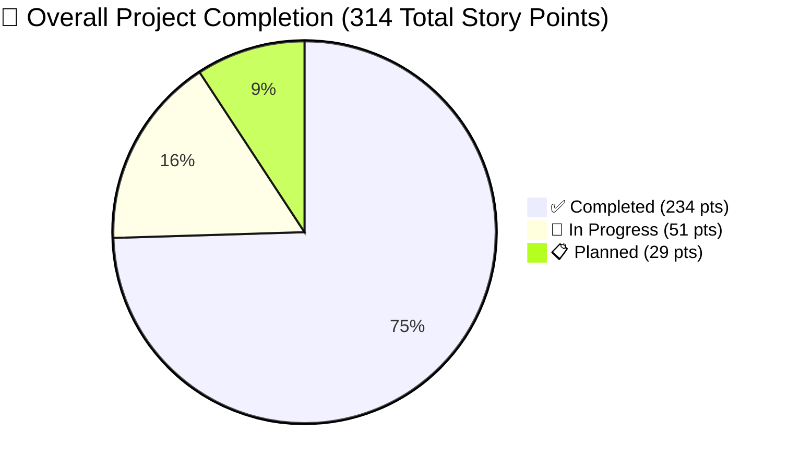
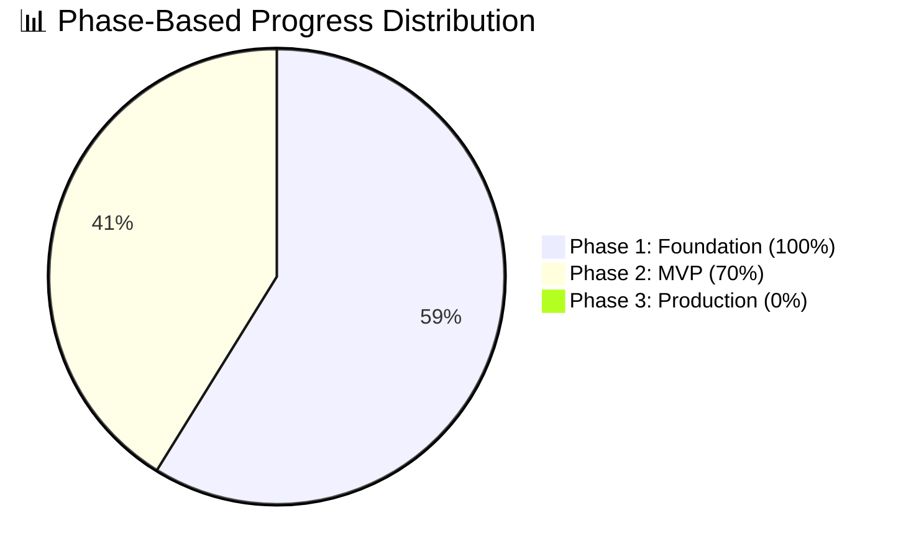
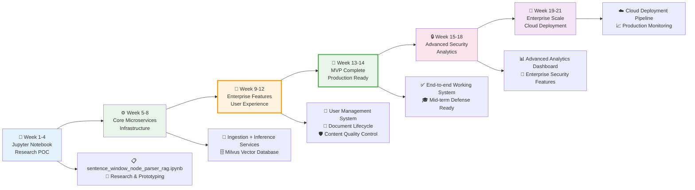
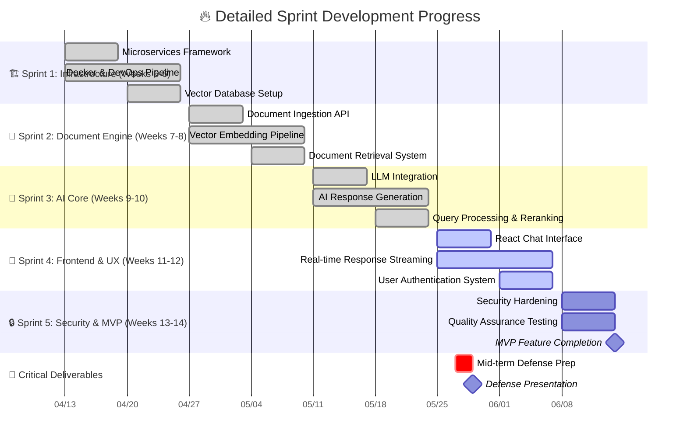
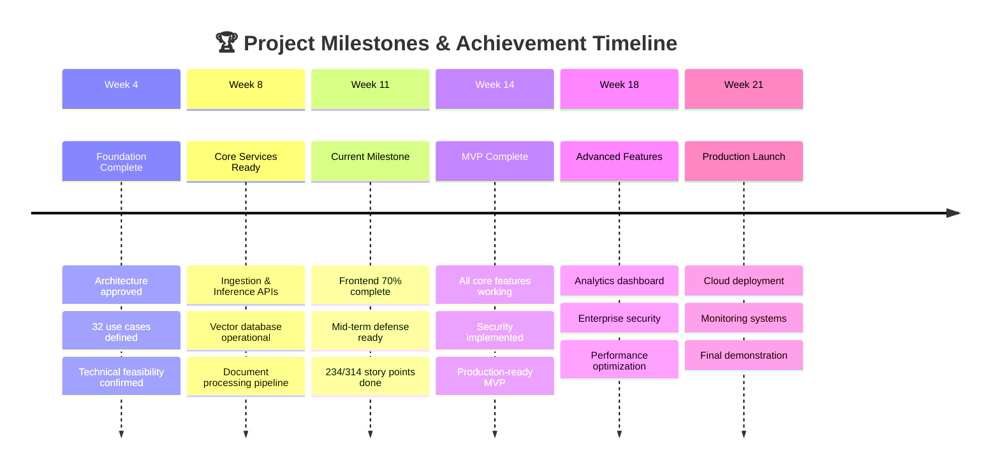
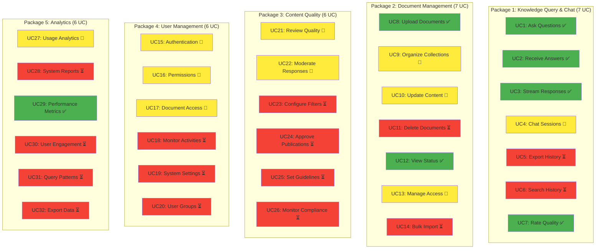
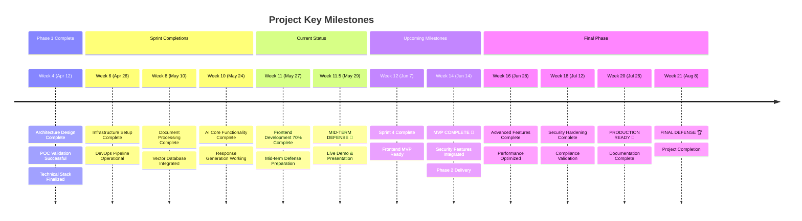
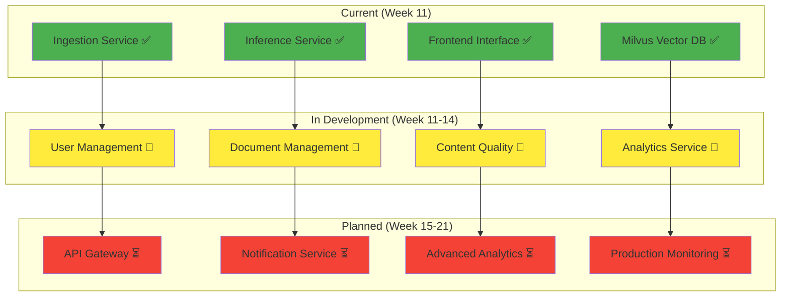
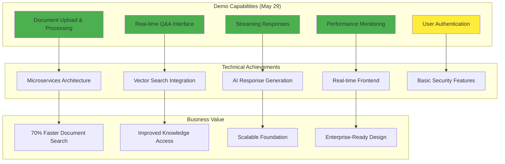
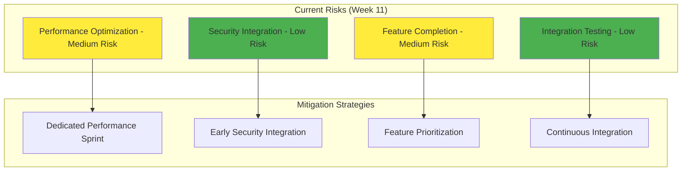

# 🚀 Enterprise RAG System - Comprehensive Visual Roadmap

## 📊 Executive Dashboard (Current: Week 11 of 21)

**🎯 Mission**: Transform Jupyter Notebook RAG POC into Enterprise-Grade Microservices System
**⏱️ Timeline**: March 16 - August 8, 2025 | **🎓 Defense**: May 29, 2025 | **📈 Progress**: 70% Complete

---

## 🗓️ Master Project Timeline (21-Week Journey)

```mermaid
gantt
    title 🏗️ Enterprise RAG System - Complete Development Roadmap
    dateFormat  YYYY-MM-DD
    axisFormat  %m/%d
    
    section 🎯 Phase 1: Foundation (Weeks 1-4)
    Requirements & Research     :done, req, 2025-03-16, 2025-03-22
    User Stories & Use Cases    :done, stories, 2025-03-23, 2025-03-29
    Architecture Design         :done, arch, 2025-03-30, 2025-04-05
    POC Validation              :done, poc, 2025-04-06, 2025-04-12
    
    section 🔧 Phase 2: MVP Development (Weeks 5-14)
    Sprint 1: Infrastructure    :done, s1, 2025-04-13, 2025-04-26
    Sprint 2: Document Engine   :done, s2, 2025-04-27, 2025-05-10
    Sprint 3: AI Core Services  :done, s3, 2025-05-11, 2025-05-24
    Sprint 4: Frontend & UX     :active, s4, 2025-05-25, 2025-06-07
    Sprint 5: Security & Testing :crit, s5, 2025-06-08, 2025-06-14
    
    section 🚀 Phase 3: Production (Weeks 15-21)
    Sprint 6: Advanced Analytics :s6, 2025-06-15, 2025-06-28
    Sprint 7: Enterprise Security :s7, 2025-06-29, 2025-07-12
    Sprint 8: Deployment & Scale :s8, 2025-07-13, 2025-07-26
    Final Integration & Demo    :s9, 2025-07-27, 2025-08-08
    
    section 🎖️ Critical Milestones
    Mid-term Defense 🎓        :milestone, defense, 2025-05-29, 0d
    MVP Feature Complete 🏆    :milestone, mvp, 2025-06-14, 0d
    Production Ready 🚀        :milestone, prod, 2025-07-26, 0d
    Final Demonstration 🎯     :milestone, final, 2025-08-08, 0d
```

## 📈 Current Progress Analytics (Week 11 Status)





---

## 🏗️ System Architecture Evolution Journey



## 🏃‍♂️ Sprint-by-Sprint Execution Timeline



---

## 🎯 Key Milestones & Success Metrics





## 🎯 Key Milestones Timeline



## 📈 Performance Metrics Dashboard

```mermaid
graph LR
    subgraph "Current Performance (Week 11)"
        A[Response Time: 2.3s] --> A1[Target: <2s]
        B[System Uptime: 98.5%] --> B1[Target: >99%]
        C[Test Coverage: 82%] --> C1[Target: >85%]
        D[User Rating: 4.2/5.0] --> D1[Target: >4.0]
    end
    
    subgraph "Sprint Velocity"
        E[Sprint 1: 45 SP] 
        F[Sprint 2: 52 SP]
        G[Sprint 3: 48 SP]
        H[Sprint 4: 40 SP (current)]
    end
    
    style A fill:#ffeb3b
    style B fill:#ffeb3b
    style C fill:#ffeb3b
    style D fill:#4caf50
```

## 🔄 Service Architecture Evolution



## 🎯 Mid-Term Defense Readiness



## 📊 Risk Assessment & Mitigation



---

## 📋 Legend

- ✅ **Completed**: Fully implemented and tested
- 🔄 **In Progress**: Currently under development
- ⏳ **Planned**: Scheduled for future sprints
- 🎯 **Milestone**: Key project milestone
- 🚀 **Major Delivery**: Significant project delivery
- 🏆 **Final Goal**: Project completion target

## 📈 Success Metrics Tracking

| Metric | Current | Target | Status |
|--------|---------|--------|--------|
| Project Completion | 70% | 100% | 🔄 On Track |
| Sprint Velocity | 46 SP/sprint | 45 SP/sprint | ✅ Above Target |
| Response Time | 2.3s | <2s | 🔄 Optimizing |
| Test Coverage | 82% | >85% | 🔄 Approaching |
| User Satisfaction | 4.2/5.0 | >4.0 | ✅ Exceeding |
| System Uptime | 98.5% | >99% | 🔄 Improving |

---

**Current Focus**: Sprint 4 completion and mid-term defense preparation (May 29, 2025)
**Next Priority**: MVP completion by Week 14 (June 14, 2025)
**Final Goal**: Production-ready system by Week 21 (August 8, 2025)
