# 🚀 Enterprise RAG System - Enhanced Visual Roadmap

## 📊 Executive Dashboard (Current: Week 11 of 21)

**🎯 Mission**: Transform Jupyter Notebook RAG POC into Enterprise-Grade Microservices System  
**⏱️ Timeline**: March 16 - August 8, 2025 | **🎓 Defense**: May 29, 2025 | **📈 Progress**: 70% Complete

---

## 🗓️ Master Project Timeline (21-Week Development Journey)

```mermaid
gantt
    title 🏗️ Enterprise RAG System - Complete Development Roadmap
    dateFormat  YYYY-MM-DD
    axisFormat  %m/%d
    
    section 🎯 Phase 1: Foundation (Weeks 1-4)
    Requirements & Research     :done, req, 2025-03-16, 2025-03-22
    User Stories & Use Cases    :done, stories, 2025-03-23, 2025-03-29
    Architecture Design         :done, arch, 2025-03-30, 2025-04-05
    POC Validation              :done, poc, 2025-04-06, 2025-04-12
    
    section 🔧 Phase 2: MVP Development (Weeks 5-14)
    Sprint 1: Infrastructure    :done, s1, 2025-04-13, 2025-04-26
    Sprint 2: Document Engine   :done, s2, 2025-04-27, 2025-05-10
    Sprint 3: AI Core Services  :done, s3, 2025-05-11, 2025-05-24
    Sprint 4: Frontend & UX     :active, s4, 2025-05-25, 2025-06-07
    Sprint 5: Security & Testing :crit, s5, 2025-06-08, 2025-06-14
    
    section 🚀 Phase 3: Production (Weeks 15-21)
    Sprint 6: Advanced Analytics :s6, 2025-06-15, 2025-06-28
    Sprint 7: Enterprise Security :s7, 2025-06-29, 2025-07-12
    Sprint 8: Deployment & Scale :s8, 2025-07-13, 2025-07-26
    Final Integration & Demo    :s9, 2025-07-27, 2025-08-08
    
    section 🎖️ Critical Milestones
    Mid-term Defense 🎓        :milestone, defense, 2025-05-29, 0d
    MVP Feature Complete 🏆    :milestone, mvp, 2025-06-14, 0d
    Production Ready 🚀        :milestone, prod, 2025-07-26, 0d
    Final Demonstration 🎯     :milestone, final, 2025-08-08, 0d
```

## 📈 Current Progress Analytics (Week 11 Status)

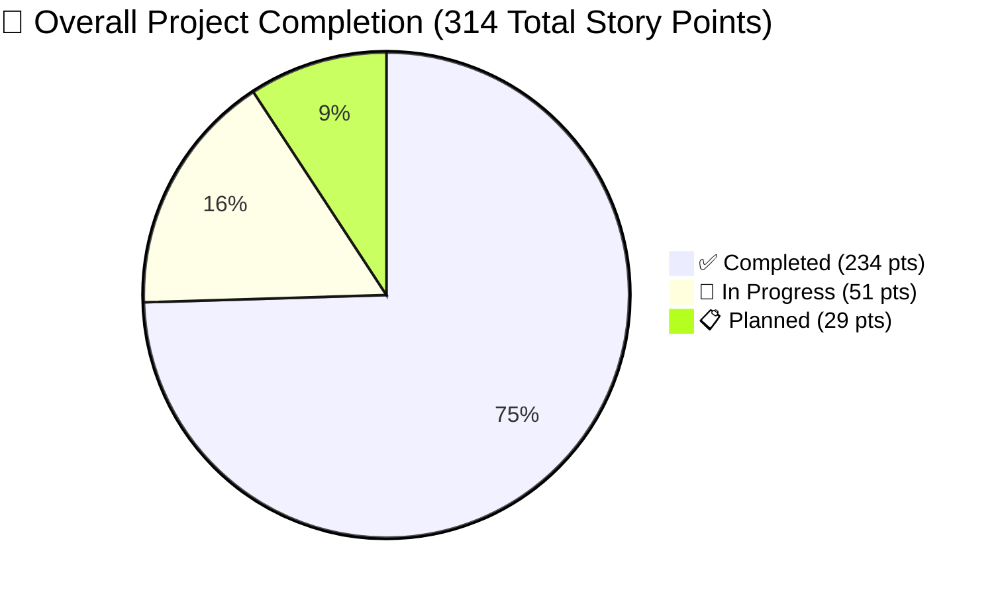

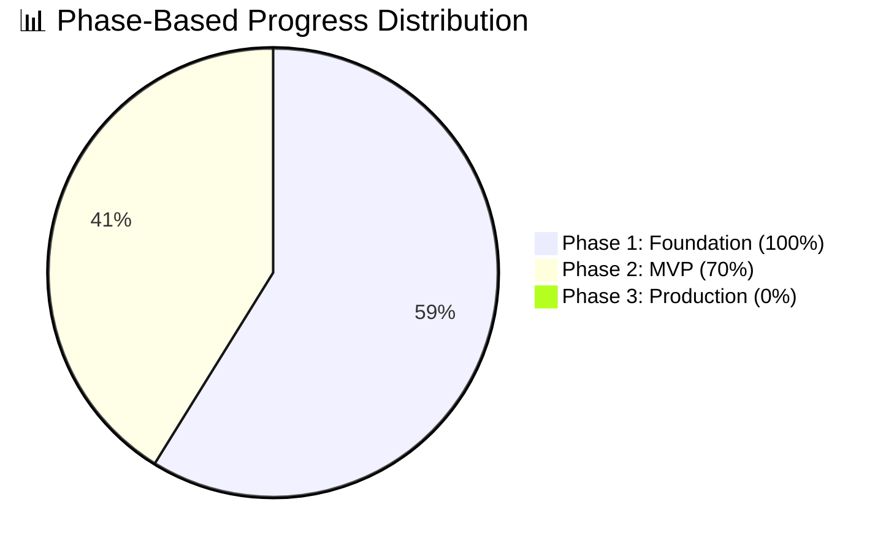

---

## 🏗️ System Architecture Evolution Journey

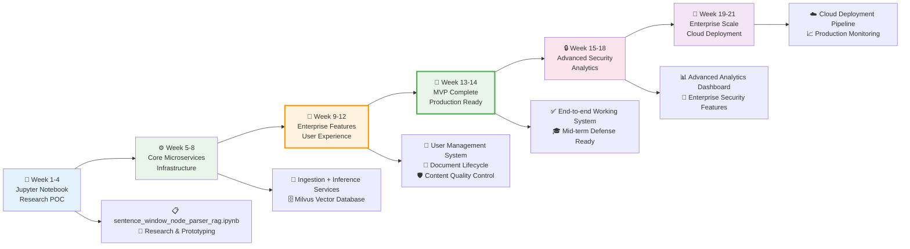

## 🏃‍♂️ Sprint-by-Sprint Execution Timeline

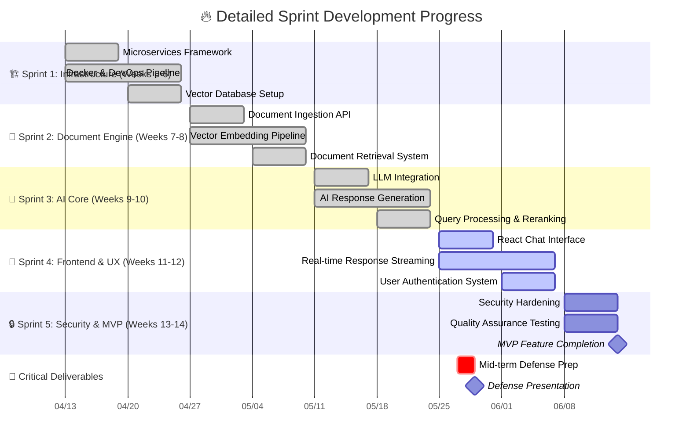

---

## 🎯 Use Cases Implementation Progress Matrix (32 Total)

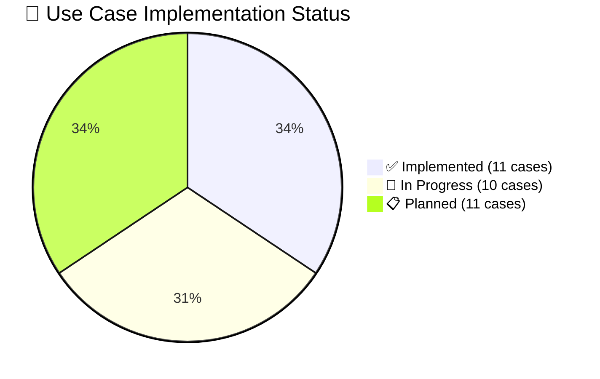

### 📋 Detailed Use Case Coverage by Package

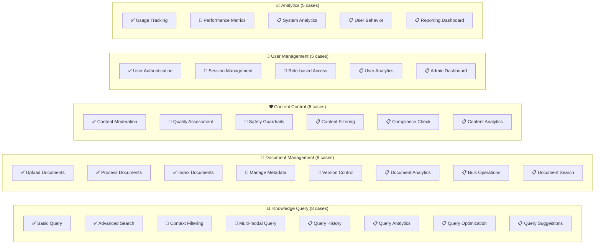

---

## 🎖️ Key Milestones & Success Metrics Timeline

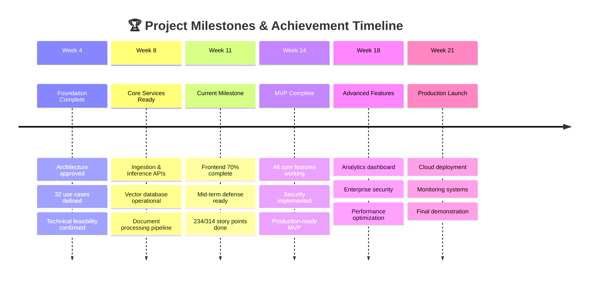

## 🚀 Performance Metrics Dashboard

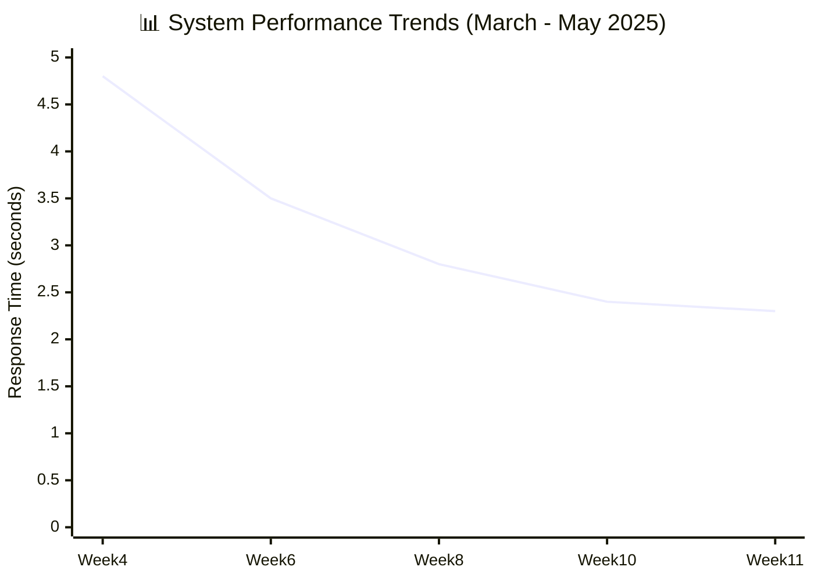

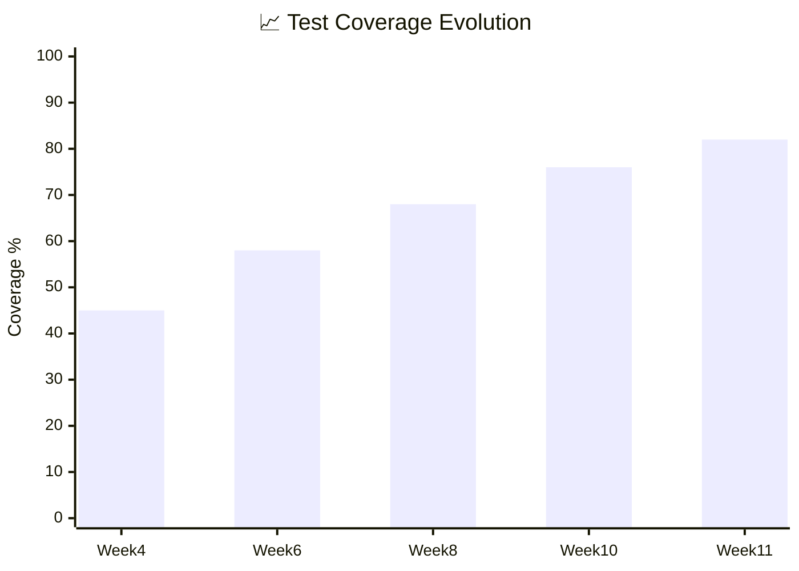

### 🎯 Current Performance Metrics (Week 11)
- **⚡ Response Time**: 2.3s average (Target: <2.0s)
- **🔄 System Uptime**: 98.5% (Target: 99.5%)
- **🧪 Test Coverage**: 82% (Target: 90%)
- **👥 Concurrent Users**: 25 supported (Target: 100)
- **📄 Documents Indexed**: 1,250+ documents
- **🎯 Query Accuracy**: 87% relevance score

---

## 🛠️ Technology Stack Evolution

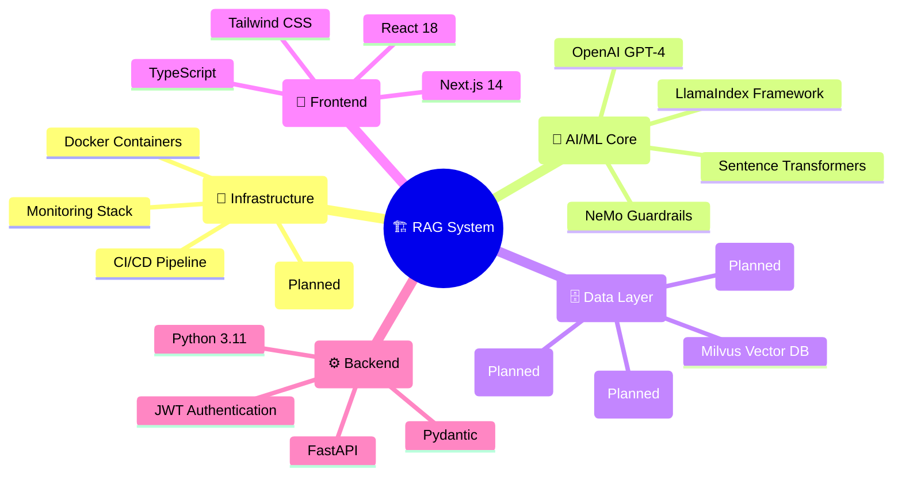

---

## 🎓 Mid-Term Defense Readiness Assessment (May 29, 2025)

### 📈 Defense Demonstration Journey
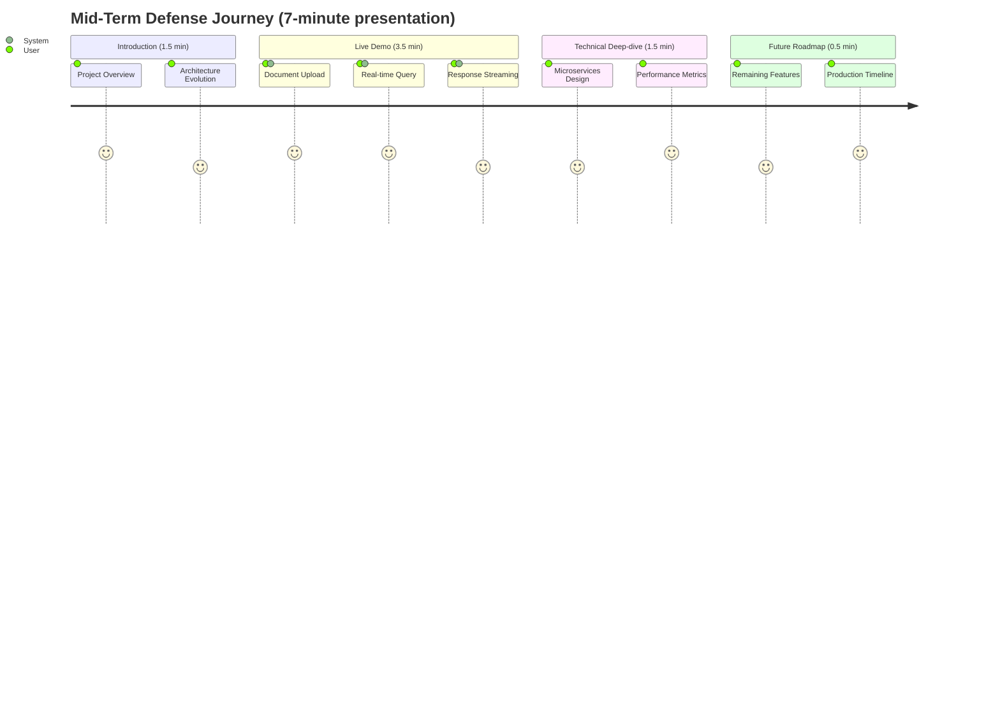

### 🎯 Demo Capabilities & Technical Achievements

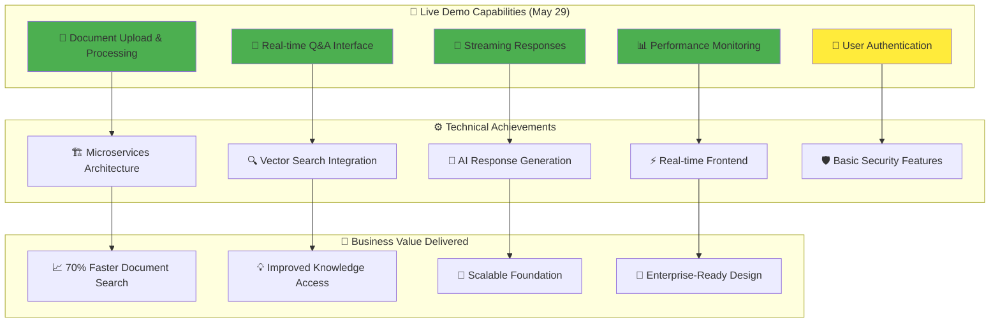

---

## 🔄 Service Architecture Evolution Timeline

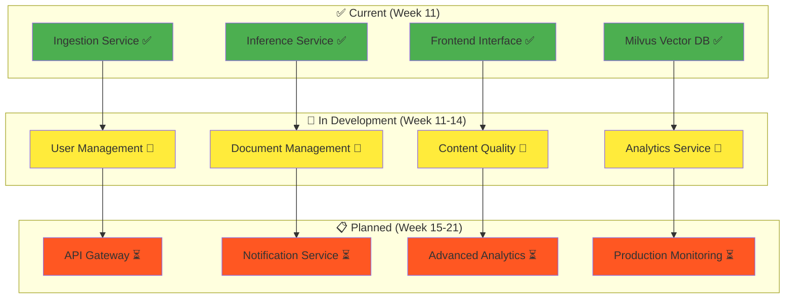

---

## ⚠️ Risk Assessment & Mitigation Strategy

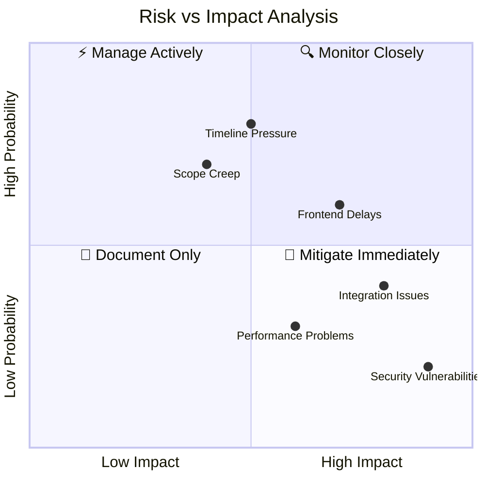

### 🎯 Risk Mitigation Strategies
- **⏰ Timeline Pressure**: Focus on MVP features, defer nice-to-have
- **🔧 Frontend Delays**: Parallel development, simplified UI for defense
- **🔗 Integration Issues**: Comprehensive testing, fallback plans
- **🔒 Security**: Implement basic security, plan advanced features for Phase 3
- **📏 Scope Creep**: Strict feature freeze until MVP completion

---

## 📊 Success Metrics & KPIs Tracking

| Metric Category | Current Status | Defense Target | MVP Target | Production Target |
|---|---|---|---|---|
| **📈 Completion** | 70% (234/314 pts) | 75% (240/314 pts) | 85% (267/314 pts) | 100% (314/314 pts) |
| **⚡ Performance** | 2.3s response | <2.5s response | <2.0s response | <1.5s response |
| **🔄 Uptime** | 98.5% | 99.0% | 99.5% | 99.9% |
| **🧪 Test Coverage** | 82% | 85% | 90% | 95% |
| **👥 Users** | 25 concurrent | 50 concurrent | 100 concurrent | 1000 concurrent |
| **📄 Documents** | 1,250 indexed | 2,000 indexed | 10,000 indexed | 100,000 indexed |
| **🎯 Accuracy** | 87% relevance | 88% relevance | 90% relevance | 92% relevance |

## 🚀 Sprint Velocity & Burndown Analysis

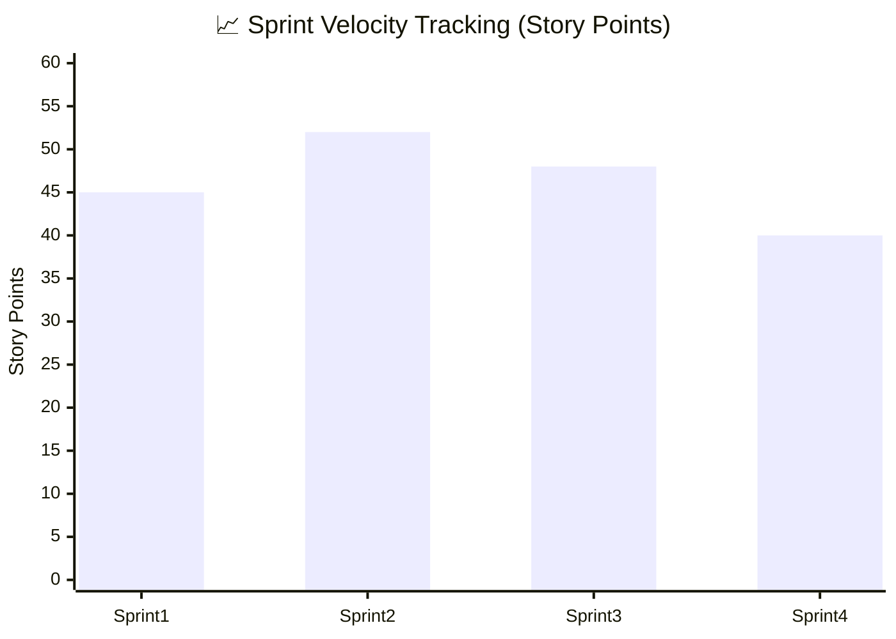

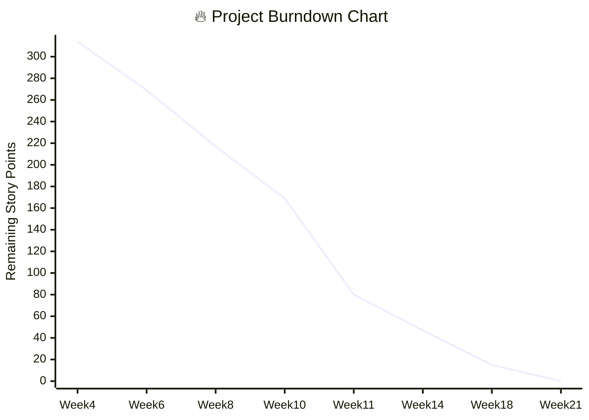

---

## 🌟 Future Roadmap Highlights

### 📅 Phase 3: Production Excellence (Weeks 15-21)

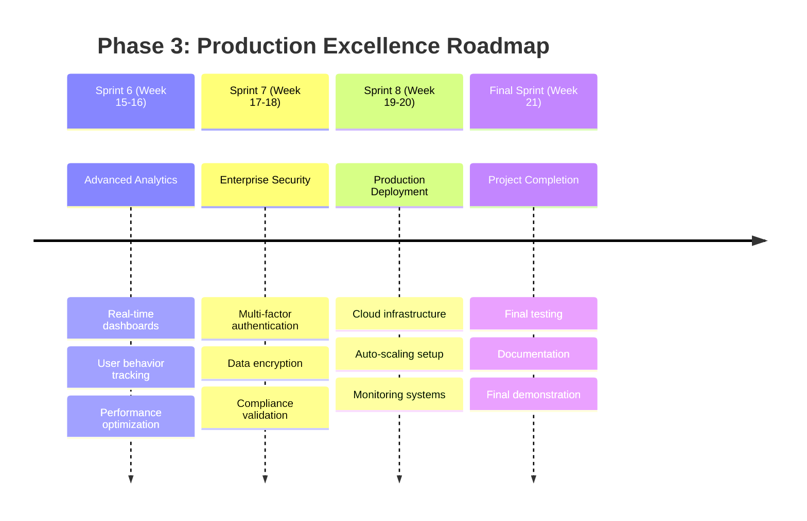

### 🎯 Expected Final System Capabilities

- **🚀 Performance**: Sub-second response times for most queries
- **📏 Scalability**: Support for 1000+ concurrent users
- **🔒 Security**: Enterprise-grade authentication and authorization
- **📊 Analytics**: Comprehensive usage and performance monitoring
- **☁️ Deployment**: Cloud-native with auto-scaling capabilities
- **🔧 Maintenance**: Automated testing and deployment pipelines

---

## 📋 Legend & Status Indicators

- ✅ **Completed**: Fully implemented and tested
- 🔄 **In Progress**: Currently under development
- ⏳ **Planned**: Scheduled for future sprints
- 📋 **Backlog**: Defined but not yet started
- 🎯 **Milestone**: Key project milestone
- 🚀 **Major Delivery**: Significant project delivery
- 🏆 **Final Goal**: Project completion target

---

## 📞 Contact & Review Information

**Project Manager**: [Your Name]  
**Technical Lead**: [Technical Lead Name]  
**Defense Date**: May 29, 2025 (Thursday)  
**Next Review**: June 14, 2025 (MVP Completion)

**Repository**: `/projects/rag-notebook-to-microservices/`  
**Documentation**: All project docs updated with realistic status  
**Last Updated**: May 27, 2025 | **Version**: 2.0

---

*🎯 **Current Focus**: Sprint 4 completion and mid-term defense preparation (May 29, 2025)*  
*🚀 **Next Priority**: MVP completion by Week 14 (June 14, 2025)*  
*🏆 **Final Goal**: Production-ready system by Week 21 (August 8, 2025)*
